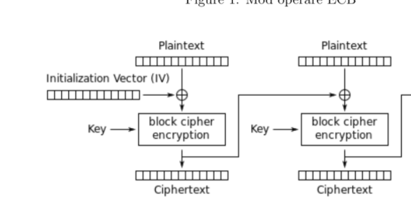

 This is the Homework for Information Security
 
 
 
 <h1>Rulare : py NodeKm.py -> py NodeA.py -> py NodeB.py -> in terminalul unde ruleaza NodeA - alegeti intre CBC si CFB. </h1>
 
 

  

<h>

Am creat 3 Noduri, doua dintre ele avand rolul de "Server".
 Initial, nodul A va trimite un mesaj  nodului KM cu modul de criptare dorit.  In timpul acesta, atat nodul KM cat si nodul B vor asculta la eventuale conectari la porturile lor (pentru KM -portul 1337 iar pentru nodul B -portul 2222).  In momentul in care KM primeste mesajul de la A, preia "legatura", alege ce cheie sa foloseasca in functie de modul de operare ales, si incepe sa cripteze atat cheia respectiva (ex k2) -folosind un vector de initializare v1 si cheia k3, cat si vectorul de initializare V pe care il va trimite celor 2 noduri( pentru vectorul V foloseste tot acelasi vector si aceeasi cheie folosita pentru a cripta cheia k2). 
Criptarea se va face in felul urmator:
<ul><li>pentru CBC - aplicam xor pe blocul de plaintext(care prima oara va fi cheia efectiva) si vectorul de initializare V(adica constanta declarata in encryptHelper),ulterior aplicam din AES functia encrypt  pe rezultatul xor ului; <li>pentru CFB: criptam vectorul de initializare V si facem xor cu plaintextul(care in prima situatie va fi vectorul de initializare v).</ul>
In continuare KM  va trimite cheia si vectorul de initializare celor doua noduri: trimite lui A prin conexiunea deja stabilita, apoi se conecteaza la B si ii trimite informatiile similare. Nodul A si B vor decripta vectorul de initializare si cheia primita folosind encryptHelper.initVector - o constanta si variabila globala -k3(tot o constanta).

Decriptarea se va face simplu: <ul><li>pentru CBC -> ne folosim de cheie si decriptam blocul iar apoi facem xor cu vectorul de initializare;
  

<li> pentru CFB -> criptam folosind cheia vectorul de initializare si facem din nou xor cu textul encriptat.</ul>
  Ambele noduri vor cripta (cu cheia rezultata + vectorul de initializare primit de la NodeKM si decriptat) un mesaj de confirmare si il vor trimite lui KM pentru a-l valida (KM trebuie sa se asigure ca toate datele au fost primite corect de catre A si B, si nimic nu a fost alterat pe parcurs, asa ca va compara mesajele trimise pentru a fi sigur ca sunt identice). Daca totul este in regula si mesajele sunt identice, KM le va transmite un mesaj insemnand ca pot sa incepe comunicarea . (In timpul acesta ei asteapta ca KM sa compare rezultatele si sa trimita cate un mesaj inapoi). 
  Nodul A va citi dintr-un fisier un text , il va cripta folosind cheia si vectorul primite de la KM si il va trimite lui B - dar se asigura ca si KM primeste datele legate de mesaj (numarul de blocuri criptate si trimise).
  Nodul B asteapta sa primeasca mesajul de la A, il decripteaza tot prin aceleasi metode, Afiseaza textul initial si il instiinteaza pe KM cate blocuri a primit si decriptat.
  In final, nodul KM va face o analiza a datelor primite de la A si B.

